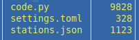

# 📻 ESP32-S3-Zero webrádió - CircuitPython

Sorry folks, this repo comes with Hungarian comments only 🙂  
Ez a projekt egy egyszerű, otthon is könnyen megépíthető internetes rádiót valósít meg.  
A célja, hogy kevés és olcsó (~4eFt) alkatrészek segítségével online rádióadókat hallgathassunk.

A kód **CircuitPython** nyelven íródott, így a módosítása és használata kezdők számára is egyszerű.

## 🛠️ Hogyan épül fel?

A rendszer szíve egy ESP32 kártya, amely az internetről letölti a zenei adatfolyamot, és egy digitális-analóg átalakítón keresztül hanggá alakítja.

1v02 - Állomás váltás csak a szoftverből  

1v22 - Beépítésre került egy 'tekerős nyomógomb' ami az állomásváltást és az első állomásra ugrást kezeli  

  

### Szükséges eszközök:
*   **Vezérlő:** [ESP32-S3-Zero](https://www.waveshare.com/wiki/ESP32-S3-Zero?srsltid=AfmBOorfqn8I1ezSHGBBIlw2pK0BOvZDR--FL35lBhwTRSxVBlx0neT8)
*   **Hangkártya (DAC):** [MAX98357a](https://www.hestore.hu/prod_10045704.html?gad_source=1&gad_campaignid=21163162680&gclid=Cj0KCQiAwYrNBhDcARIsAGo3u31R_6zZiZZxwd9yj28r72FO6T526xeCuA3uZ3R8JjvgYFxM5n-z6VUaAoVbEALw_wcB)
*   **Rotary enkóder:** [EC-11](https://modulshop.hu/ec-11-rotary-encoder-modul?gad_source=1&gad_campaignid=21423119443&gclid=Cj0KCQiAwYrNBhDcARIsAGo3u31sm7AfpCMMxEo-_kZ6QTVhSEUY2_c3FlV4BZJfM9iKV7LHxtDuHLsaAphYEALw_wcB)
*   **Potméter:** 56 Ohm / 1W
*   **Hangszóró:** 8 Ohm / 1W
*   **Szoftver:** CircuitPython 10.x.x

## 🚀 Telepítés 3 lépésben

1.  **CircuitPython firmware telepítése:**
    Csatlakoztasd az ESP32-t a számítógéphez, és telepítsd rá a lapkának megfelelő [CircuitPython](https://circuitpython.org/downloads) rendszert.
    Ekkor megjelenik egy `CIRCUITPY` nevű meghajtó a számítógépeden (mint egy pendrive).

3.  **Fájlok másolása:**
    Ha akarod, töltsd le ezt a repót (vagy a ZIP-et), és másold át a `CIRCUITPY` meghajtó gyökerébe.
    De a működéshez csak erre a három filére lesz szükséged 
      

5.  **Beállítás (Wi-Fi & Állomáslista):**
    A kedvenc rádióállomásaid adatai írd be a `stations.json` fájlba.
    A `settings.toml` fájlban add meg a saját Wi-Fi adataidat. 
    Ez legyen a formátum:  
    CIRCUITPY_WIFI_SSID = "your ssid name"  
    CIRCUITPY_WIFI_PASSWORD = "your pwd"

## ⚙️ Használat

A bekapcsolás után az eszköz automatikusan csatlakozik a megadott Wi-Fi hálózatra és elindítja a lejátszást.
Az állomásokat az enkóder tekerésével tudod váltani. A tekerőgombot megnyomva újraindul az eszkőz és a lista első állomására ugrik.
