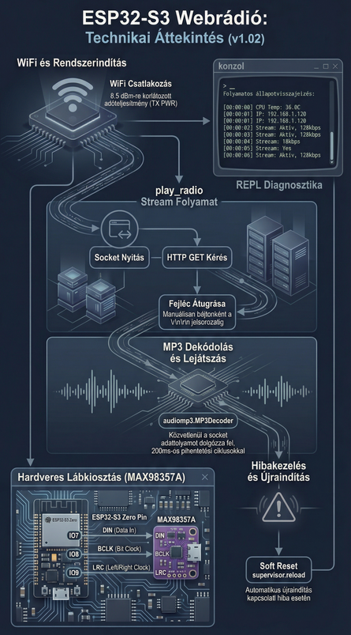
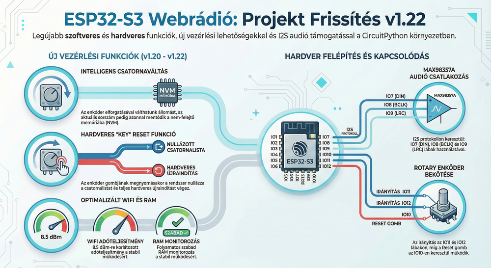

# 📻 Webrádió (ESP32-S3-Zero + CircuitPython)

Ez a projekt egy egyszerű, otthon is könnyen megépíthető internetes rádiót valósít meg.
A célja, hogy kevés és olcsó alkatrészek segítségével online rádióadókat hallgathassunk.

A kód **CircuitPython** nyelven íródott, így a módosítása és használata kezdők számára is egyszerű.

## 🛠️ Hogyan épül fel?

A rendszer szíve egy ESP32 kártya, amely az internetről letölti a zenei adatfolyamot, és egy digitális-analóg átalakítón keresztül hanggá alakítja (1v02)

Beépítésre került egy 'tekerős nyomógomb' ami az állomásváltást és az első éllomásra ugrást kezeli (1v22)

### Szükséges eszközök:
*   **Vezérlő:** ESP32-Zero / S3
*   **Hangkártya (DAC):** MAX98357a
*   **Rotary enkóder:** EC-01
*   **Potméter:** 56 Ohm / 1W
*   **Hangszóró:** 8 Ohm / 1W
*   **Szoftver:** CircuitPython 10.x

## 🚀 Telepítés 3 lépésben

1.  **CircuitPython telepítése:**
    Csatlakoztasd az ESP32-t a számítógéphez, és telepítsd rá a megfelelő [CircuitPython](https://circuitpython.org/) rendszert.
    Ekkor megjelenik egy `CIRCUITPY` nevű meghajtó a számítógépeden (mint egy pendrive).

3.  **Fájlok másolása:**
    Töltsd le ezt a repót (vagy a ZIP-et), és másold át a tartalmát a `CIRCUITPY` meghajtó gyökerébe.

4.  **Beállítás (Wi-Fi & Állomáslista):**
    A `settings.toml` fájlban add meg a saját Wi-Fi adataidat
    A kedvenc rádióállomásaid adatai írd be a `stations.json` fájlba.

## ⚙️ Használat

A bekapcsolás után az eszköz automatikusan csatlakozik a megadott Wi-Fi hálózatra és elindítja a lejátszást.
Az állomásokat az enkóder tekerésével tudod váltani. Megnyomva újraindul az eszkőz és a lista első állomására lép.
