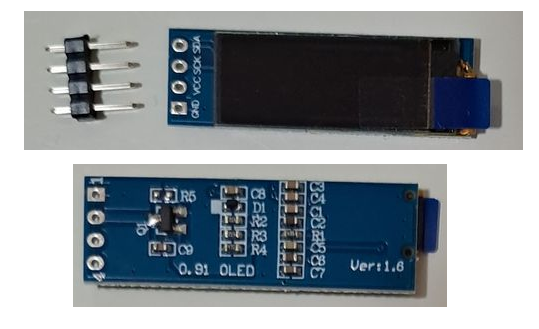

# 0.91" OLED Display - SSD1306
### EXPLANATION FOR CARBON-BASED DEVELOPERS 😊
  

*English:*
The 0.91" OLED display module is a self-luminous monochrome graphic display with 128 x 32 pixels. It uses the SSD1306 controller and communicates over the I2C bus, so only two signal lines are needed: SDA and SCL. Since the panel is OLED-based, no backlight is required. The module typically accepts 3.3V to 5V on VCC, but the underlying SSD1306 controller itself is a low-voltage device; always treat the module datasheet as the final authority for wiring and power. The display is compact, high-contrast, and well suited for short text, status lines, icons, meters, and simple dashboards.

*Magyar:*
A 0,91" OLED kijelző egy önvilágító, monokróm grafikus megjelenítő 128 x 32 pixeles felbontással. Az SSD1306 vezérlőt használja, és I2C buszon kommunikál, ezért csak két jelvezeték kell: SDA és SCL. Mivel OLED panelről van szó, háttérvilágításra nincs szükség. A modul jellemzően 3,3V–5V VCC tápfeszültséget fogad, de a belső SSD1306 vezérlő önmagában kisfeszültségű eszköz; huzalozásnál mindig a konkrét modul adatlapja az irányadó. A kijelző kicsi, nagy kontrasztú, és rövid szövegekhez, státuszsorokhoz, ikonokhoz, műszerekhez és egyszerű dashboardokhoz ideális.

### Key Technical Specifications - Főbb műszaki jellemzők
*English:*
- Display type: Monochrome OLED graphic display.
- Controller: SSD1306.
- Resolution: 128 x 32 pixels.
- Interface: I2C / IIC serial communication.
- Supply: Typical modules support 3.3V to 5V VCC.
- Pins: VCC, GND, SDA, SCL.
- Backlight: None; pixels are self-emissive.
- Typical module size: About 0.91" diagonal, compact footprint.
- Addressing: I2C slave address is usually 0x3C or 0x3D depending on SA0 configuration; many modules ship with a fixed address, commonly 0x3C.

*Magyar:*
- Kijelző típusa: monokróm OLED grafikus kijelző.
- Vezérlő: SSD1306.
- Felbontás: 128 x 32 pixel.
- Interfész: I2C / IIC soros kommunikáció.
- Táp: a tipikus modulok 3,3V–5V VCC-t támogatnak.
- Lábak: VCC, GND, SDA, SCL.
- Háttérvilágítás: nincs; a pixelek maguk fénykibocsátók.
- Jellemző méret: kb. 0,91" képátló, kis helyigény.
- Címzés: az I2C slave cím az SA0 beállítástól függően jellemzően 0x3C vagy 0x3D; sok modul fix címen érkezik, gyakran 0x3C.  

> ⚠️ Az instrukció forrásai:
> - SSD1306 datasheet: https://cdn-shop.adafruit.com/datasheets/SSD1306.pdf
> - 0.91" I2C SSD1306 OLED module datasheet: https://www.electronicaembajadores.com/datos/pdf1/lc/lcgr/lcgrol3.pdf
> - Waveshare 0.91inch OLED Module wiki: https://www.waveshare.com/wiki/0.91inch_OLED_Module
---
## NECESSARY DATA FOR THE AGENT
### PIN Reference
Dedicated pins (Aliases in brackets are common module silkscreen labels)

| PIN  | Function                         | Aliases |
| ---- | -------------------------------- | ------- |
| GND  | System ground                    |         |
| SDA  | I2C data line                    | (DIN)   |
| SCL  | I2C clock line                   | (CLK)   |
| VCC  | Power input, typically 3.3V to 5V | (VCC)   |

*Notes:*
- This is an I2C module; no separate CS or DC pins are used on the 4-pin version.
- The SSD1306 supports 0x3C or 0x3D addressing depending on SA0; code should not hard-code only one address unless the module datasheet confirms it.
- 128 x 32 modules use only part of the SSD1306 RAM layout that is originally designed for 128 x 64 panels.

### CODE GENERATION LOGIC & RULES

**1. Display Driver Choice:**
- Prefer the most idiomatic display library for the target environment.
- For **CircuitPython**, prefer `displayio` with the SSD1306 display driver when available, and use the standard library stack rather than manual I2C byte pushing.
- For **MicroPython**, prefer a mature SSD1306 driver module over handwritten protocol code.
- For **Arduino/C++**, prefer a tested SSD1306/OLED library rather than custom bit-banging unless the user explicitly requests a low-level implementation.

**2. Initialization Logic:**
- Always initialize the display with the correct geometry: **128 x 32**.
- If the library requires it, try the common I2C address first and support fallback probing for the alternate SSD1306 address.
- Clear the screen immediately after initialization to avoid ghost content.
- Apply rotation, contrast, or inversion only when explicitly needed by the user’s hardware or UI design.

**3. I2C Handling:**
- Use hardware I2C whenever possible.
- Keep the bus speed within the module/library defaults unless the target platform and wiring are known to be stable at a higher speed.
- If the bus scan finds no device, check wiring, power, ground, and the I2C address before debugging the display code.

**4. Rendering Rules:**
- Treat the panel as a low-resolution UI surface.
- Prefer short labels, compact status text, small icons, and high-contrast layouts.
- Avoid long paragraphs, thin fonts, and dense tables on-screen.
- For text mode, assume that only a few lines fit comfortably; design layouts around the 128 x 32 area.
- When updating the screen, redraw only the portions that changed if the framework supports partial refresh or buffered drawing.
- In animation loops, avoid unnecessary full-screen refreshes at very high rates.

**5. Power and Electrical Rules:**
- Assume the module is self-luminous and does not need a backlight pin or PWM backlight control.
- Do not confuse module VCC with the SSD1306 controller’s internal logic voltage from the bare-chip datasheet; the module may include the required support circuitry.
- If the user targets a bare SSD1306 panel instead of a finished module, re-check the voltage and panel-driving constraints from the datasheet before generating code or wiring guidance.

**6. Text and Font Handling:**
- Use fonts that are readable at 128 x 32 pixels.
- Default to minimalist layouts: single-line status, two-line status, or very small four-line text blocks.
- If the user asks for localization or accented characters, verify that the chosen font and library support the required glyph set.

**7. Error Handling:**
- If the display does not respond, generate code that reports I2C scan results, the selected address, and initialization status when practical.
- Fail gracefully: if the OLED is missing, keep the rest of the application running and log the issue instead of crashing the whole program.

> **🤖 SYSTEM NOTE FOR THE AI AGENT:**  
> This document defines hardware-specific operational rules and physical constraints. When generating code, **adapt these rules to the specific programming language, framework, and environment requested by the user in the active prompt.** Always use the most idiomatic and efficient approach for the target environment (e.g., native libraries for CircuitPython, interrupts for C++/MicroPython) while strictly respecting the hardware characteristics detailed above.
