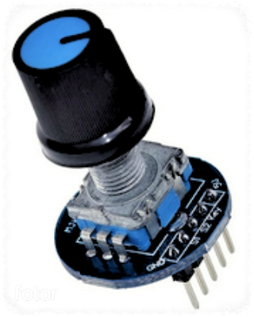

# EC-11
### EXPLANATION FOR CARBON-BASED DEVELOPERS 😊
  

*English:*
The ​​EC11 rotary encoder is an (incremental) electromechanical module that converts rotational motion into digital signals. The direction of rotation can be determined from the signals arriving at its two (S1/CLK, S2/DT) outputs. It features a built-in (KEY/SW) pushbutton, which is actuated by pressing the rotating shaft axially. External pull-up resistors are connected to the three digital outputs. Debouncing of the contacts is performed by capacitors. The circuit requires a power supply of 5V or 3V3 (Vcc) and GND for operation.   

*Magyar:*
Az EC-11 forgó jeladó egy (inkrementális elvű) elektromechanikus modul, amely a forgó mozgást digitális jellé alakítja. A forgatás iránya a két (S1/CLK, S2/DT) kimenetre érkező jelekből meghatározható. Rendelkezik egy beépített (KEY/SW) nyomógombbal, amit a forgató tengely hosszirányú megnyomásával lehet működtetni. A három digitális kimenetre külső felhúzó ellenállások vannak kötve. Az érintkezők prellmentesítését kondenzátorok végzik. Az áramkör működéséhez 5V vagy 3.3V (Vcc) tápfeszültség és GND szükséges.

### Key Technical Specifications - Főbb műszaki jellemzők
*English:*
- Type: Incremental (Quadrature) rotary encoder with integrated momentary push-button.
- Resolution: 20 pulses per 360° rotation (with detents).
- Operating Voltage: Compatible with 3.3V and 5V logic levels.
- Output Signals: Two-phase (A and B) square wave signals with 90° phase shift.
- Switch: Normally Open (NO), active LOW when pressed.
- Hardware Features: Built-in pull-up resistors (typically 10kΩ) and RC filter capacitors for basic hardware debouncing.
  
*Magyar:*
- Típus: Inkrementális (kvadratúra) forgó jeladó beépített nyomógombbal.
- Felbontás: 20 impulzus / 360° fordulat (raszteres).
- Üzemi feszültség: 3.3V és 5V logikai szintekkel kompatibilis.
- Kimeneti jelek: Kétfázisú (A és B) négyszögjel, 90°-os fáziseltolással.
- Kapcsoló: Alaphelyzetben nyitott (NO), lenyomáskor aktív LOW szint.
- Hardveres jellemzők: Beépített felhúzó ellenállások (jellemzően 10kΩ) és RC szűrő kondenzátorok az alapvető prellmentesítéshez.

> ⚠️ Az instrukció forrásai:
> - https://www.mouser.com/datasheet/2/15/EC11-1370808.pdf?srsltid=AfmBOorc9aECW_k3qs_R8w5l8OX6pCvFJBU6klEIUNfVBmqe6s65-T20
> - https://modulshop.hu/ec-11-rotary-encoder-modul
---
## NECESSARY DATA FOR THE AGENT
### PIN Reference
Dedicated pins (Aliases in brackets are common module silkscreen labels)

| PIN  | Function                         | Aliases |
| ---- | -------------------------------- | ------- |
| GND  | System ground                    |         |
| S1   | Phase A - Pulses during rotation | (CLK)   |
| S2   | Phase B - Pulses during rotation | (DT)    |
| KEY  | Pushbutton switch - active LOW   | (SW)    |    
| 5V   | Power input 2.5V to 5.5V DC      | (VCC)   |

*Notes:*
S2 (DT) is 90° offset from S1 (CLK).

### CODE GENERATION LOGIC & RULES

**1. Reading & Hardware Handling:**
- The EC11 is a mechanical switch; **avoid polling S1/S2 in delay-heavy loops.**
- Always utilize the most efficient hardware-tracking method available in the target environment:
  - For **C/C++** and **MicroPython**: Prioritize hardware interrupts (External Interrupts / IRQ) triggering on `CHANGE` or `FALLING` edges for high-speed rotation tracking.
  - For **CircuitPython**: Prioritize native built-in hardware modules designed for this purpose (e.g., `rotaryio`) over manual pin tracking.

**2. Direction Detection Logic (If manual implementation is required):**
- *Simple Edge Detection (Fallback):* If S1 transitions from HIGH to LOW (FALLING edge), check S2 immediately. If S2 is HIGH → Clockwise (CW). If S2 is LOW → Counter-Clockwise (CCW).
- *State Machine (Preferred for precision):* Use a lookup table or state machine evaluating both S1 and S2 states to prevent half-step bouncing.

**3. Debouncing:**
- *Hardware:* Assume the PCB module includes basic RC filters.
- *Software (Button):* Use a non-blocking 5-50ms lockout timer (e.g., `millis()`, `ticks_ms()`, or `monotonic()`) for the KEY (SW) to prevent double-click triggers.
- *Software (Encoder):* If not using a state machine or a native module, a minimal software debounce within the callback/ISR might be needed depending on the MCU speed.

**4. Pull-up Configuration:**
- Always configure input pins explicitly with internal pull-ups enabled (e.g., `INPUT_PULLUP`, `Pin.PULL_UP`, `Pull.UP`) to ensure stable HIGH states, even if the module has physical resistors. The KEY pin requires a FALLING edge or LOW state detection.

**5. Concurrency & Shared State (Crucial for interrupt-based logic):**
- Ensure that the counter/position variables updated in the background (within an ISR or callback) are treated according to the target language's concurrency rules.
- **For compiled languages (C/C++):** Declare shared variables as `volatile`. Ensure atomic reading of the encoder position in the main loop (e.g., briefly disable interrupts while copying the value) if the architecture requires it.
- **For interpreted languages (MicroPython/CircuitPython):** Ensure proper global variable scoping or use object-oriented state management to access the callback-modified data safely in the main loop.

> **🤖 SYSTEM NOTE FOR THE AI AGENT:** 
> This document defines hardware-specific operational rules and physical constraints. When generating code, **adapt these rules to the specific programming language, framework, and environment requested by the user in the active prompt.** Always use the most idiomatic and efficient approach for the target environment (e.g., native libraries for CircuitPython, interrupts for C++/MicroPython) while strictly respecting the hardware characteristics detailed above.
