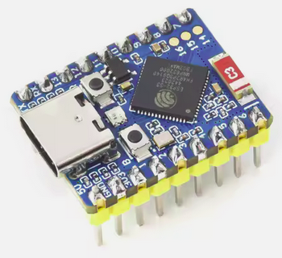

# ESP32‑S3‑Zero  

> ⚠️ Az instrukció forrásai:
> - https://www.waveshare.com/wiki/ESP32-S3-Zero
> - https://documentation.espressif.com/esp32-s3_datasheet_en.pdf
> - https://documentation.espressif.com/esp32-s3_technical_reference_manual_en.pdf

## NECESSARY DATA FOR THE AGENT

### GPIO Pins and Functions (GPIO lábak és funkciók):
  *English:* The ESP32-S3-Zero module exposes 24 GPIOs (13+11) from the ESP32-S3FH4R2 chip. Each GPIO can be multiplexed with various functions (digital I/O, ADC, I2C, I2S, SPI, PWM/LEDC, etc.) according to the chip datasheet. In total the S3 supports up to 4 SPI, 2 I2C, 2 I2S, 3 UART and 2 ADC interfaces on these GPIOs 

  *Magyar:* Az ESP32-S3-Zero modul 24 GPIO lábat (13+11) biztosít az S3 chipből. Minden GPIO többfunkciós: digitális I/O, analóg ADC-bemenet, I2C, I2S, SPI, PWM (LEDC) stb. lehet belőle a chip multiplex szerint. Összességében a chip 4 SPI, 2 I2C, 2 I2S, 3 UART és 2 ADC perifériát tesz elérhetővé a GPIO-kon.  

## GPIO Reference

The ESP32‑S3 provides a flexible GPIO matrix. Most digital peripherals (SPI, I2C, I2S, PWM, UART) can be routed to almost any GPIO that is not internally reserved.

### ADC mapping

ADC1: GPIO1–GPIO10  
ADC2: GPIO11–GPIO20

GPIO11–13 pins belong to the ADC2 controller, they cannot be used when Wi-Fi is active. If you need analog input in addition to Wi-Fi, use the GPIO1–10 (ADC1) range.

GPIO14-18 only internal soldering points of the board - without holes

Recommended analog inputs on this board: **GPIO7–GPIO10 or GPIO11–GPIO14** (stable routing, commonly exposed pins).

---

# Reserved / dedicated pins

Do **not** use these pins for external peripherals.

| GPIO | Function |
|------|----------|
| GPIO21 | Onboard WS2812 RGB LED |
| GPIO19 | USB D‑ |
| GPIO20 | USB D+ |
| GPIO33–37 | PSRAM interface (not exposed on module) |
| GPIO0 | Boot strap pin |

Notes:

- GPIO0 LOW during reset → **download mode**
- GPIO19/20 are used by **USB‑CDC**
- GPIO21 is wired to the **onboard RGB LED**

---

# Pins best avoided (but usable if necessary)

| GPIO | Reason |
|------|--------|
| GPIO43 | Default UART TX |
| GPIO44 | Default UART RX |
| GPIO39–42 | JTAG interface |

JTAG mapping if used:

| Signal | GPIO |
|------|------|
| TCK | 39 |
| TDO | 40 |
| TDI | 41 |
| TMS | 42 |

---

# Safe GPIO pool

These pins are typically free on the ESP32‑S3‑Zero board and safe for peripherals.

GPIO1  
GPIO2  
GPIO3  
GPIO4  
GPIO5  
GPIO6  
GPIO7  
GPIO8  
GPIO9  
GPIO10  
GPIO11  
GPIO12  
GPIO13  
GPIO14  
GPIO15  
GPIO16  
GPIO17  
GPIO18

*Notes:*  
GPIO15–16 | XTAL_32kHz input pins.  
GPIO45–46 | Strapping pins. Use with caution (affects boot voltage/logs)

# Recommended peripheral layout

Example layout that avoids internal buses.

## I2C

SDA → GPIO8  
SCL → GPIO9

## SPI (secondary SPI controller)

MOSI → GPIO11  
MISO → GPIO13  
SCLK → GPIO12  
CS → GPIO4 or GPIO5 or GPIO15

## I2S example

BCLK → GPIO4  
LRCK → GPIO5  
DOUT → GPIO6  
DIN → GPIO7

## PWM

Any safe GPIO except:

19, 20, 21, 0

## Analog sensors

Preferred:

GPIO7–GPIO12

---

# USB rule

GPIO19 = USB D‑  
GPIO20 = USB D+

Do not assign these pins to other peripherals.

---

# Boot rule

GPIO0 LOW during reset → Download mode.

Avoid circuits that pull GPIO0 low during boot.

---

# Built‑in RGB LED

The board contains a **WS2812 RGB LED** connected to **GPIO21**.

Avoid mixing:

- `digitalWrite(LED_BUILTIN)`
- NeoPixel / FastLED libraries

Only one driver should control the LED.

---

# Summary

Avoid:

GPIO0, GPIO19, GPIO20, GPIO21, GPIO33–37, GPIO45, GPIO46

Prefer:

GPIO1–13, (GPIO14-18 & GPIO38-42 - Safe electrically, but hard to solder beacuse no side PINs on the PCB)
