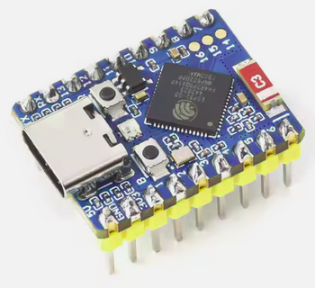

# ESP32‑S3‑Zero  
## EXPLANATION FOR CARBON-BASED DEVELOPERS 😊
  

*English:* ESP32-S3-Zero (without pin header) and ESP32-S3-Zero-M (with pin header) are tiny in size with castellated holes, making them easy to integrate into other host boards. ESP32-S3-Zero comes with an onboard Type-C USB connector, which exposes most of the unused pins in a small form factor. It is equipped with the ESP32-S3FH4R2 chip, integrated Wi-Fi and BLE5.0, featuring 4MB Flash and 2MB PSRAM. In addition, there are hardware encryption accelerator, RNG, HMAC and Digital Signature modules to meet the safety requirements of IoT and provide rich peripheral interfaces. Moreover, its multiple low-power working modes support most application scenarios such as IoT, mobile devices, wearable electronic devices, and smart homes.  
  
- Equipped with Xtensa® 32-bit LX7 dual-core processor, up to 240MHz main frequency.  
- Supports 2.4GHz Wi-Fi (802.11 b/g/n) and Bluetooth® 5 (LE).  
- Built-in 512KB of SRAM and 384KB ROM, onboard 4MB Flash memory and 2MB PSRAM.  
- Castellated module and onboard ceramic antenna, allows soldering direct to carrier boards.  
- Supports flexible clock, module power supply independent setting, and other controls to realize low power consumption in different scenarios.  

*Magyar:* Az ESP32-S3-Zero (tüskesor nélküli) és az ESP32-S3-Zero-M (tüskesorral ellátott) apró méretű modulok, amelyek könnyen integrálhatók más alaplapokba. Az ESP32-S3-Zero beépített Type-C USB csatlakozóval rendelkezik, amely kis helyigény mellett biztosít hozzáférést a legtöbb nem használt lábhoz. A modult ESP32-S3FH4R2 chip hajtja, beépített Wi-Fi és BLE5.0 támogatással, valamint 4MB flash és 2MB PSRAM memóriával rendelkezik. Emellett hardveres titkosítási gyorsító, RNG, HMAC és digitális aláírás modulok is találhatók benne, amelyek megfelelnek az IoT biztonsági követelményeinek és gazdag periféria interfészt kínálnak. Továbbá több alacsony fogyasztású üzemmódja támogatja a legtöbb alkalmazási területet, például az IoT-t, mobil eszközöket, DIY elektronikai eszközöket és az okosotthon megoldásokat.

### GPIO Pins and Functions - GPIO lábak és funkciók
  *English:* The ESP32-S3-Zero module exposes 24 GPIOs (13+11) from the ESP32-S3FH4R2 chip. Each GPIO can be multiplexed with various functions (digital I/O, ADC, I2C, I2S, SPI, PWM/LEDC, etc.) according to the chip datasheet. In total the S3 supports up to 4 SPI, 2 I2C, 2 I2S, 3 UART and 2 ADC interfaces on these GPIOs 

  *Magyar:* Az ESP32-S3-Zero modul 24 GPIO lábat (13+11) biztosít az S3 chipből. Minden GPIO többfunkciós: digitális I/O, analóg ADC-bemenet, I2C, I2S, SPI, PWM (LEDC) stb. lehet belőle a chip multiplex szerint. Összességében a chip 4 SPI, 2 I2C, 2 I2S, 3 UART és 2 ADC perifériát tesz elérhetővé a GPIO-kon.  

> ⚠️ Az instrukció forrásai:
> - https://www.waveshare.com/wiki/ESP32-S3-Zero
> - https://documentation.espressif.com/esp32-s3_datasheet_en.pdf
> - https://documentation.espressif.com/esp32-s3_technical_reference_manual_en.pdf

---
## NECESSARY DATA FOR THE AGENT
## GPIO Reference

ESP32-S3 uses a flexible GPIO matrix.  
Digital peripherals such as SPI, I2C, I2S, PWM, and UART can be routed to almost any GPIO that is not internally reserved.  
Operating Logic Voltage: 3.3V. Do not connect 5V logic signals directly to any GPIO.

### ADC mapping

ADC1: GPIO1–GPIO10  
ADC2: GPIO11–GPIO20

GPIO11–GPIO13 are connected to ADC2. Unlike classic ESP32, the ESP32-S3 CAN use ADC2 pins while Wi-Fi is active. For analog input with Wi-Fi enabled, use GPIO1–GPIO10 (ADC1).

GPIO14-18 only internal soldering points of the board - without holes

Recommended analog inputs on this board: **GPIO7–GPIO10 or GPIO11–GPIO14** (stable routing, commonly exposed pins).

# Reserved / dedicated pins

Do **not** use these pins for external peripherals.

| GPIO | Function |
|------|----------|
| GPIO21 | Onboard WS2812 RGB LED |
| GPIO19 | USB D‑ |
| GPIO20 | USB D+ |
| GPIO33–37 | PSRAM interface (not exposed on module) |
| GPIO0 | Boot strap pin |

Notes:

- GPIO0 LOW during reset → **download mode**
- GPIO19/20 are used by **USB‑CDC**
- GPIO21 is wired to the **onboard RGB LED**

# Pins best avoided (but usable if necessary)

| GPIO | Reason |
|------|--------|
| GPIO43 | Default UART TX |
| GPIO44 | Default UART RX |
| GPIO39–42 | JTAG interface |

JTAG mapping if used:

| Signal | GPIO |
|------|------|
| TCK | 39 |
| TDO | 40 |
| TDI | 41 |
| TMS | 42 |

# Safe GPIO pool

These pins are typically free on the ESP32‑S3‑Zero board and safe for peripherals.

GPIO1  
GPIO2  
GPIO3  
GPIO4  
GPIO5  
GPIO6  
GPIO7  
GPIO8  
GPIO9  
GPIO10  
GPIO11  
GPIO12  
GPIO13  
GPIO14  
GPIO15  
GPIO16  
GPIO17  
GPIO18

*Notes:*  
GPIO15–16 | XTAL_32kHz input pins - but there is no XTAL on this board 
GPIO45–46 | Strapping pins. Use with caution (affects boot voltage/logs)
GPIO3 | Hidden strapping pin. Also use with caution (affects boot voltage/logs)

# Recommended peripheral layout
Example layout that avoids internal buses.

## I2C (Inter-Integrated Circuit)
SDA → GPIO8  
SCL → GPIO9

## SPI (SPI2 / FSPI)
MOSI → GPIO11  
MISO → GPIO13  
SCLK → GPIO12  
CS → GPI10 or GPIO4 or GPIO5

## I2S (Inter-IC Sound)
BCLK → GPIO4  
LRCK → GPIO5  
DOUT → GPIO6  
DIN → GPIO7

## PWM
Any safe GPIO except:
19, 20, 21, 0

## Analog sensors
Preferred:
GPIO7–GPIO12

# USB rule
GPIO19 = USB D‑  
GPIO20 = USB D+
Do not assign these pins to other peripherals.

# Boot rule
GPIO0 LOW during reset → Download mode.
Avoid circuits that pull GPIO0 low during boot.

# Built‑in RGB LED
The board contains a **WS2812 addressable RGB LED** connected to **GPIO21**.

**Important Rules:**
- A standard `digitalWrite(LED_BUILTIN, HIGH)` will **not** work on this addressable LED and must be avoided.
- **For Arduino environments (Core v3.x+):** Prefer the native, lightweight `neopixelWrite(21, R, G, B)` function for simple color control instead of importing heavy external libraries. *(Example: `neopixelWrite(21, 255, 0, 0);` for Red).*
- **For complex animations:** You may use `FastLED` or `Adafruit_NeoPixel` libraries, but **never mix** them with `neopixelWrite()`. 
- Only **one** driver or method should control the LED at any given time.

# Summary
Avoid:
GPIO0, GPIO19, GPIO20, GPIO21, GPIO33–37, GPIO45, GPIO46

Prefer:
GPIO1–13, (GPIO14-18 & GPIO38-42 - Safe electrically, but hard to solder beacuse no side PINs on the PCB)

### CODE GENERATION LOGIC & RULES

**1. Pin Selection & Exclusions:**
- **Strictly avoid** using GPIO 0, 19, 20, 21, 33-37, 45, and 46 for general inputs/outputs or peripherals. 
- **Physical constraint:** GPIO 14–18 and 38–42 are only available as bottom solder pads. Do not assign them to standard breadboard wiring or external modules unless the user explicitly confirms they are soldering to the bottom pads.
- Always prefer GPIO 1–13 for standard user peripherals.

**2. USB CDC vs. UART (Serial Output):**
- The onboard Type-C port is wired directly to the ESP32-S3's native USB OTG (GPIO 19 & 20), *not* through a UART bridge.
- When generating debug output or console logs, configure the environment to use **USB CDC On Boot** (e.g., `Serial` mapped to USB_CDC in Arduino, or standard `print()` over native USB in Python). Do not map logs to UART0 (GPIO 43/44) unless an external serial adapter is mentioned.

**3. ADC & Wi-Fi Compatibility (CRITICAL AI CORRECTION):**
- **Do not apply legacy ESP32 restrictions.** On the ESP32-S3, **ADC2 can be used simultaneously with Wi-Fi.** Feel free to allocate ADC2 pins (GPIO 11-20) for analog reading even if wireless networking is active.

**4. Onboard RGB LED (GPIO 21):**
- Treat GPIO 21 strictly as an addressable WS2812 data line. Never use basic `digitalWrite()` or standard PWM generation on this pin. 

> **🤖 SYSTEM NOTE FOR THE AI AGENT:** 
> This document defines hardware-specific operational rules, physical constraints, and pin routing for the ESP32-S3-Zero. When generating code, **strictly enforce the pin exclusions and adapt the logic to the specific programming language/framework** (e.g., ESP-IDF, Arduino, MicroPython, CircuitPython) requested by the user. Prioritize modern S3 capabilities and ignore legacy ESP32 hardware limitations.
