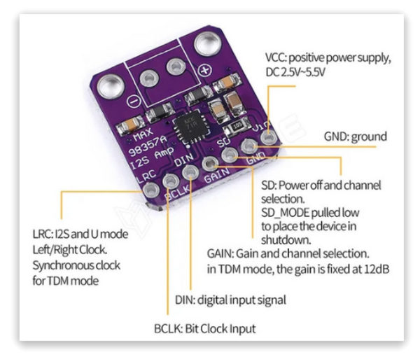

# MAX98357A
### EXPLANATION FOR CARBON-BASED DEVELOPERS 😊
  

*English:* The MAX98357A is a compact, highly efficient Class-D mono amplifier with an I2S interface, ideal for microcontroller projects requiring digital audio output. It combines a digital-to-analog converter (DAC) and an amplifier into a single breakout board. The output is a 330kHz PWM square wave that is averaged out by the speaker's own coil inductance. Because of this, the device must drive speakers directly and cannot be used as a pre-amplifier for another stage. For optimal performance at 5V, a power supply capable of at least 800mA is recommended.

*Magyar:* A MAX98357A egy kompakt, rendkívül hatékony, I2S interfészű D-osztályú mono erősítő, amely ideális választás mikrokontrolleres projektekhez, ahol digitális hangkimenetre van szükség. Ez az eszköz egyesíti az I2S DAC-ot (digitális-analóg átalakító) és az erősítőt egyetlen apró lapkán. Mivel az erősítő kimeneti jele egy 330 kHz-es PWM négyszögjel, amit a hangszóró tekercsének induktivitása átlagol ki, az eszközt közvetlenül a hangszóróra kell kötni, nem használható előerősítőként egy másik erősítőhöz. A tápellátáshoz 5VDC mellett javasolt legalább 800 mA-es tápegység használata az optimális teljesítmény érdekében.

### Key Technical Specifications - Főbb műszaki jellemzők
*English:*
- Power Output: It is surprisingly powerful for its size, delivering up to 3.2 Watts into a 4-ohm speaker (at 5V power and 10% THD).
- Voltage Range: It operates on a wide DC voltage range from 2.5V to 5.5V.
- Efficiency: As a Class-D amplifier, it is extremely efficient, making it perfect for portable and battery-powered projects.
- Protection: It features built-in thermal and over-current protection.
- Outputs: The outputs are "Bridge-Tied," meaning they connect directly to the speaker terminals and should never be connected to ground.  
  
*Magyar:*
- Teljesítmény: 3,2 Watt teljesítményt képes leadni egy 4 Ohmos hangszórón (5V tápfeszültség és 10% THD mellett).
- Tápfeszültség: Széles tartomány, 2,5V és 5,5V DC között üzemeltethető.
- Hatékonyság: Mivel D-osztályú (Class-D) vezérlővel rendelkezik, rendkívül hatékony, így kiválóan alkalmas hordozható, akkumulátoros projektekhez.
- Védelem: Beépített termikus és túláramvédelemmel van ellátva.
- Kimenet: A kimenetek "Bridge-Tied" (hídba kötött) kialakításúak, ami azt jelenti, hogy közvetlenül a hangszóróhoz csatlakoznak, nem pedig a földhöz (GND).

### Digital Input and Configuration
*English:*
The amplifier does not support analog inputs; it uses the standard I2S digital audio protocol.

- I2S Pins: It uses three main pins for data: LRC (Left/Right Clock), BCLK (Bit Clock), and DIN (Data Input). It does not require a Master Clock (MCLK).
- Adjustable Gain: The GAIN pin allows you to select between five gain settings: 3dB, 6dB, 9dB (default), 12dB, or 15dB.
- SD / MODE Pin: This multi-purpose pin can be used to put the chip into shutdown mode or to select which I2S channel is output (Left, Right, or a stereo average). By default, it outputs a (L+R)/2 stereo mix to mono.

*Magyar:*
Az erősítő nem támogat analóg bemeneteket; kizárólag a szabványos I2S digitális audió protokollt támogatja.

- I2S Pinek: Három fő pint használ az adatok fogadásához: LRC (bal/jobb csatorna órajel), BCLK (bit órajel) és DIN (adat bemenet). Külön MCLK órajelre nincs szüksége.
- Választható erősítés (Gain): A GAIN pin konfigurálásával ötféle erősítési szint állítható be: 3dB, 6dB, 9dB (alapértelmezett), 12dB vagy 15dB.
- SD / MODE funkció: Ez a többcélú PIN használható a chip teljes leállítására (Shutdown), vagy annak kiválasztására, hogy melyik I2S csatornát (bal, jobb vagy a kettő átlaga) továbbítsa a mono kimenetre. Alapértelmezés szerint a sztereó jelet (L+R)/2 módon keveri mono kimenetté.

> ⚠️ Az instrukció forrásai:
> - https://cdn-learn.adafruit.com/downloads/pdf/adafruit-max98357-i2s-class-d-mono-amp.pdf
> - https://www.hestore.hu/prod_10045704.html
---
## NECESSARY DATA FOR THE AGENT
### PIN Reference
Dedicated pins (Aliases in brackets are common silkscreen/code labels)

| PIN    | Function                     | Aliases          |
| ------ | ---------------------------- | ---------------- |
| Vin    | Power input 2.5V to 5.5V DC  | (VCC)            |
| GND    | System ground                |                  |
| SD     | Shutdown / Mode select       | (SD_MODE)        |
| GAIN   | Gain select                  |                  |
| DIN    | Data in - I2S                | (SDATA, DOUT)    |          
| BCLK   | Bit Clock - I2S              | (SCK, BITCLK)    |
| LRC    | Left/Right Clock - I2S       | (WS, LRCLK)      |

*Notes:*
This device does not require a Master Clock (MCLK); if your controller provides one, it can remain disconnected

### GAIN (PIN)
Manages the amplification levels;

- 15dB: 100K resistor between GAIN and GND.
- 12dB: GAIN connected directly to GND.
- 9dB: Unconnected (Default).
- 6dB: GAIN connected directly to Vin.
- 3dB: 100K resistor between GAIN and Vin.

*Notes:*
The system defaults to 9dB if left floating.

### SD / MODE (PIN)
A multi-functional pin for power management and channel selection;

- Shutdown: Connect to GND (voltage < 0.16V) to disable the chip.
- Stereo Mix (L+R)/2: Default mode for the breakout (via internal/external resistors).
- Right Channel only: Voltage between 0.77V and 1.4V.
- Left Channel only: Voltage higher than 1.4V

### Analog Output
Speaker Output (+ / -): Bridge-Tied Load (BTL) terminals.
Critical Constraint: These must be connected directly to the speaker. They alternate polarity and carry a 330kHz PWM signal; they must never be connected to ground or used as a pre-amplifier input.

#### CODE GENERATION LOGIC & RULES

**1. Hardware Interface (I2S):**
- Always use native hardware I2S peripherals and standard libraries for the target environment (e.g., `driver/i2s.h` for ESP-IDF, `I2S.h` for Arduino, `machine.I2S` for MicroPython, `audiobusio.I2SOut` for CircuitPython). 
- Never attempt to use software bit-banging for I2S audio generation.

**2. Pin Configuration & MCLK:**
- Map the three essential pins: BCLK, LRC (WS), and DIN (Data Out from MCU) to the microcontroller's I2S-capable pins.
- **Crucial:** Do not allocate, configure, or pass an MCLK (Master Clock) pin in the software initialization, as the MAX98357A does not require one. Leave MCLK parameters as `-1`, `None`, or unused depending on the framework.

**3. Audio Data Format:**
- Configure the I2S peripheral to use the standard **Philips I2S format** (not Left-Justified or Right-Justified, unless specifically modified by hardware resistors).
- Set the sample rate and bit depth (typically 16-bit or 32-bit) dynamically based on the user's specific audio source or prompt. The chip automatically adapts to standard sample rates (8kHz to 96kHz).

**4. SD / MODE Control (If software-controlled):**
- If the user prompt requests software control over the amplifier's power state, configure the MCU pin connected to `SD` as a standard digital output.
- Set the pin `LOW` (0V) to mute/shutdown the amplifier. Set it `HIGH` (3.3V/5V logic) for normal operation (default stereo mix to mono).

> **🤖 SYSTEM NOTE FOR THE AI AGENT:** 
> This document defines hardware-specific operational rules and physical constraints. When generating code, **adapt these rules to the specific programming language, framework, and environment requested by the user in the active prompt.** Always use the most idiomatic and efficient approach for the target environment while strictly respecting the hardware characteristics detailed above.

